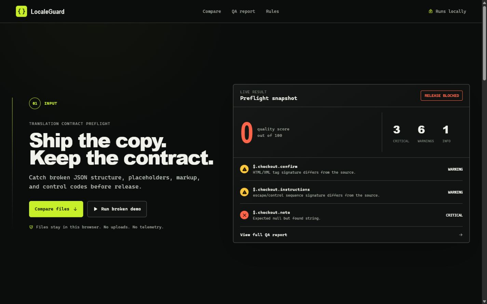

# LocaleGuard

**LocaleGuard is a local-first preflight tool for JSON translations.** Load a source locale and a target locale, then catch broken structure, placeholders, markup, escapes, and GameMaker-style control markers before a release reaches players.

## Judge quickstart

```bash
npm install
npm run dev
```

Open the local URL printed by Vite. The app starts with the **Broken demo** fixture loaded. Select **Analyze translation**, inspect the findings, then switch to **Valid fixture** to see a clean result. No account, API key, or upload is required.

For the full local verification path:

```bash
npm run typecheck
npm run lint
npm test
npm run build
```



The preview image is part of the submission capture package and is referenced here at `docs/localeguard-preview.png`.

## What it solves

Translation QA is often a visual pass through a diff or a spreadsheet. That misses the small technical contracts embedded in strings: a renamed placeholder, one deleted escape sequence, a reordered control marker, or a JSON value that quietly became the wrong type.

LocaleGuard compares the source and target JSON trees locally. It reports the exact JSON path, expected and actual contract signatures, severity, and a suggested remediation. The result is deterministic: the same pair of files produces the same findings and score.

## How to use it

1. Choose or drop a source `.json` file and a target `.json` file, up to 5 MB each.
2. Edit either document in the built-in workbench if needed.
3. Run **Analyze translation**.
4. Filter or search the report, expand a finding for expected versus actual values, and export the report as Markdown.

The three built-in fixtures are useful for a quick review:

| Fixture | Demonstrates |
| --- | --- |
| Broken demo | Missing and extra keys, type drift, array length, placeholder, markup, and escape regressions |
| Valid fixture | Changed prose with all checked contracts intact |
| Control-code demo | Synthetic GameMaker-style control-marker regressions without using game dialogue |

## Supported validation rules

LocaleGuard intentionally checks implementation contracts rather than judging translated prose.

| Area | Validation |
| --- | --- |
| JSON structure | Nested missing and extra keys, primitive types, `null`, arrays, and array lengths |
| ICU | Placeholder names and formatter kinds, in source order |
| Mustache | Double/triple-brace placeholders and section operators, in source order |
| printf | Conversion specifications, including positional indexes; literal `%%` is ignored |
| HTML/XML | Opening, closing, and self-closing tag sequence |
| Escapes | Literal escape sequences and C0 control characters, in source order |
| GameMaker-style markers | Compact and bracket forms, separators, line markers, ordering, and repetition |

Critical findings cover missing keys, type mismatches, and GameMaker-style marker changes. Warnings cover arrays and string-contract mismatches. Extra target keys are informational. The score starts at 100 and deducts 25 per critical finding, 10 per warning, and 2 per informational finding, floored at zero.

## Architecture

```text
Source JSON + Target JSON
          |
          v
  Browser parsing and comparison engine
          |
          +--> structural walker: keys, types, arrays
          +--> token extractors: ICU, Mustache, printf, tags, escapes, markers
          |
          v
  stable findings, severity summary, score, Markdown report
```

The reusable TypeScript engine lives in [`src/engine/index.ts`](src/engine/index.ts). The React/Vite interface in [`src/App.tsx`](src/App.tsx) handles file selection, drag and drop, editing, fixture loading, filtering, search, and local Markdown export. Engine behavior is covered in [`src/engine/index.test.ts`](src/engine/index.test.ts).

## Privacy model

LocaleGuard is local-first by design. Files are read in the browser, parsed in memory, and exported through the browser's download mechanism. The app contains no backend, authentication, telemetry, network upload path, or API key requirement.

## Deliberate limits

This is a preflight checker, not a full localization management system or an ICU/HTML parser.

- It does not assess translation quality, cultural fit, terminology, or line-length constraints.
- It checks ICU placeholder signatures, but not plural/select branch semantics, branch completeness, or the text nested inside branches.
- It checks HTML/XML tag sequence, but not attribute names, values, quoting, or semantic validity.
- Its GameMaker-style support targets the compact and bracket marker forms implemented in the engine; uncommon dialects may need an additional extractor and tests.
- JSON files are limited to 5 MB in the UI. Very large catalogs and non-JSON formats are outside the current interface.

## Read-only Deltarune localization case study

The project was informed by a localization QA pattern familiar in GameMaker-based game modding: ordinary-looking text can carry control codes that change portraits, pacing, choices, or text behavior. A reviewer can translate every visible word correctly and still damage the file by removing, duplicating, or reordering one marker.

LocaleGuard models that risk with synthetic fixture strings only. No game files, dialogue, or copyrighted localization text are included, uploaded, or required. The case study shaped the marker extractor and the choice to preserve token order and multiplicity, rather than treating tokens as an unordered set.

## Building with Codex and GPT-5.6

Codex and GPT-5.6 accelerated the implementation work: decomposing the comparison engine, drafting targeted test cases, and iterating on the local UI. They were used as implementation partners, not as an authority on what should be validated.

The important human decisions were product decisions: keep files in the browser, avoid judging prose, make failures explainable at a JSON path, preserve marker order and repetition, expose a deterministic score, include safe synthetic fixtures, and state the parser limits plainly. Those boundaries keep the tool useful without pretending it can certify a translation.

## Project details

- License: [MIT](LICENSE)
- Devpost copy: [`docs/DEVPOST.md`](docs/DEVPOST.md)
- Recorded-demo plan: [`docs/DEMO_SCRIPT.md`](docs/DEMO_SCRIPT.md)
- Submission readiness: [`docs/SUBMISSION_CHECKLIST.md`](docs/SUBMISSION_CHECKLIST.md)
- Live URL: **[PENDING: deploy URL has not been created]**

## Development commands

| Command | Purpose |
| --- | --- |
| `npm run dev` | Start the Vite development server |
| `npm run typecheck` | Type-check the project |
| `npm run lint` | Run ESLint with zero warnings allowed |
| `npm test` | Run the Vitest engine suite |
| `npm run build` | Type-check and produce a production build |
| `npm run preview` | Serve the built app locally |
